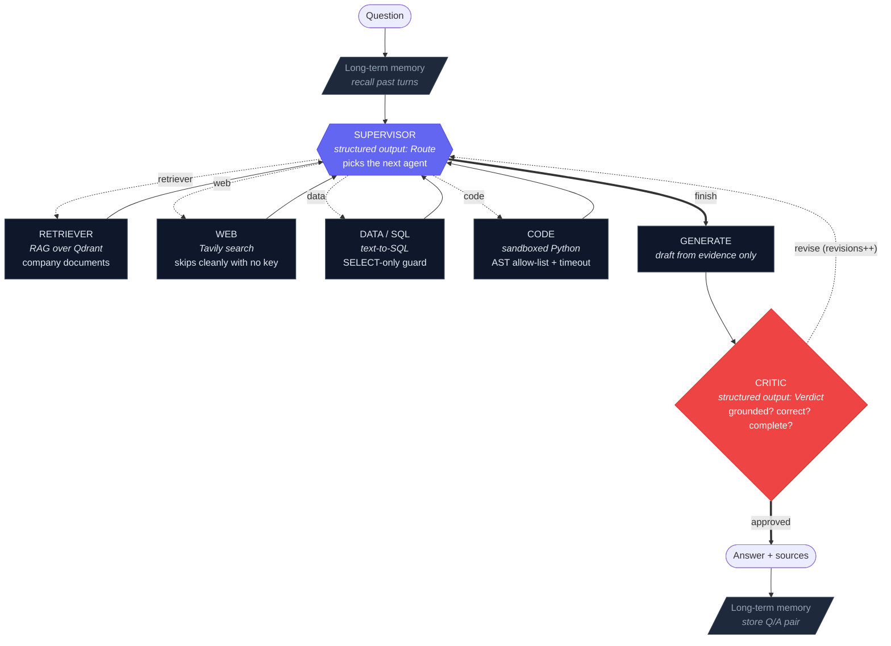

# Multi-Agent AI Analyst

A supervisor agent plans and delegates to four specialists — **documents (RAG)**, **web**, **database (text-to-SQL)** and **sandboxed code** — a **critic** verifies the answer before you ever see it, and the whole system is **measured** with RAGAS + an LLM judge and **traced** in Langfuse.

Built on LangGraph. Runs on **100% free tiers, no credit card**, using your own keys from a local `.env`.

> A single RAG agent can only retrieve and answer. "How many customers churned last quarter, and why?" needs a *database query* for the number, *document retrieval* for the reasons, and often a *calculation* on top. No one tool answers it — so this system routes, gathers, verifies, and only then replies.

---

## The graph



The machine-generated version is always available from the running system — `GET /graph`, or `make graph`.

**The graph cannot run forever.** Three independent guarantees, any one of which is sufficient:

1. `recursion_limit` (default 25) on the compiled graph.
2. A step budget in the supervisor that forces `finish` before that limit is reached.
3. `route_after_critic` has **no edge back to the supervisor** once `revisions > MAX_REVISIONS`.

---

## Setup — 5 minutes

### 1. Get your own free keys

Every developer uses their **own** keys; rate limits are per account, so a shared key throttles everyone.

| Service | Used for | Get it at | Free tier | Card? | Required? |
|---|---|---|---|---|---|
| **Google Gemini** | LLM **and** embeddings (default) | [aistudio.google.com/apikey](https://aistudio.google.com/apikey) | generous, per account | No | **Yes**¹ |
| Qdrant | vector store | embedded — no signup, or [cloud.qdrant.io](https://cloud.qdrant.io) | 1 GB | No | built in |
| Tavily | web search (F4) | [tavily.com](https://tavily.com) | 1,000 searches/month | No | optional |
| Langfuse | tracing (F12) | [cloud.langfuse.com](https://cloud.langfuse.com) | free tier | No | optional |
| **OpenAI** | alternative LLM + embeddings | [platform.openai.com/api-keys](https://platform.openai.com/api-keys) | — **paid** | **Yes** | optional |
| DeepSeek | alternative LLM (chat only) | [platform.deepseek.com](https://platform.deepseek.com) | trial credits | — | optional |
| Render | backend host | [render.com](https://render.com) | free 512 MB | No | for F14 |
| Vercel | frontend host | [vercel.com](https://vercel.com) | hobby | No | for F14 |

¹ Unless you switch to OpenAI for **both** chat and embeddings — see below.

Everything optional **degrades gracefully** — the web agent skips with a recorded reason, tracing turns itself off, and nothing crashes.

### Choosing a provider

Three interchangeable backends, one `LLM_PROVIDER` variable:

| `LLM_PROVIDER` | Chat model | Embeddings | Keys needed | Cost |
|---|---|---|---|---|
| `gemini` *(default)* | `gemini-2.5-flash` | `gemini-embedding-001` | `GOOGLE_API_KEY` | free, no card |
| `openai` | `gpt-4o-mini` | `text-embedding-3-small` | `OPENAI_API_KEY` | paid |
| `deepseek` | `deepseek-chat` | — *(borrowed)* | `DEEPSEEK_API_KEY` **+** Gemini or OpenAI | low |

```bash
# OpenAI for everything
LLM_PROVIDER=openai
OPENAI_API_KEY=sk-...

# Mix: OpenAI chat quality, free Gemini vectors
LLM_PROVIDER=openai
OPENAI_API_KEY=sk-...
GOOGLE_API_KEY=...
EMBED_PROVIDER=gemini
```

Two things worth knowing:

- **Chat and embeddings are chosen separately.** `EMBED_PROVIDER` blank means "auto": follow `LLM_PROVIDER` where that provider has embeddings, otherwise fall back to whichever key is present, Gemini first. DeepSeek ships **no** embedding endpoint, so it always borrows — `require_llm_key()` says so explicitly rather than failing later with a confusing error.
- **Switching the embedding provider changes the vector dimension**, which invalidates your existing collection. Re-ingest: `python -m ingestion.ingest --reset`. The code detects a mismatch and tells you this rather than silently writing unsearchable vectors.

**On the rubric:** the brief requires free tiers with no credit card. `gemini` satisfies that and stays the default; `openai` is there because you asked for it, and it does cost money.

### 2. Install and configure

```bash
cp .env.example .env          # Windows: copy .env.example .env
# open .env and paste your GOOGLE_API_KEY

cd backend
python -m venv .venv && source .venv/bin/activate    # Windows: .venv\Scripts\activate
pip install -r requirements.txt
```

`.env` is git-ignored. Never commit it.

### 3. Build the data

```bash
python -m ingestion.seed_db      # builds data/company.db (deterministic)
python -m ingestion.ingest       # chunks + embeds the docs into Qdrant, then sanity-searches
```

### 4. Prove it works

```bash
python -m scripts.smoke          # every "Done when" criterion, one line each
pytest                           # offline suite  (117 tests, no key needed)
pytest -m live                   # live suite     (needs your key)
```

### 5. Run it

```bash
uvicorn app.api:app --reload --port 8000     # terminal 1

cd ../frontend
cp .env.local.example .env.local
npm install && npm run dev                   # terminal 2 -> http://localhost:3000
```

Or the single-process route: `pip install gradio && python app_gradio.py`.

---

## Repository layout

```
.
├── backend/
│   ├── app/
│   │   ├── state.py           F1  AgentState - the shared state every node reads/writes
│   │   ├── config.py          F1  .env loading, fail-fast on Gemini, graceful on the rest
│   │   ├── llm.py                 Gemini / DeepSeek providers + structured-output helper
│   │   ├── vectorstore.py     F2  Qdrant, with auto-probed embedding dimension
│   │   ├── sql_guard.py       F5  read-only SQL validation (layer 1 of 2)
│   │   ├── sandbox.py         F6  AST allow-list + isolated process + rlimits
│   │   ├── agents/
│   │   │   ├── retriever.py   F3
│   │   │   ├── web.py         F4
│   │   │   ├── data.py        F5
│   │   │   ├── code.py        F6
│   │   │   ├── supervisor.py  F7
│   │   │   ├── critic.py      F8
│   │   │   └── generate.py        answer drafting / redrafting
│   │   ├── graph.py           F9  StateGraph wiring + ask() + astream_events()
│   │   ├── memory.py          F10 long-term memory over past turns
│   │   ├── observability.py   F12 Langfuse callbacks (optional)
│   │   └── api.py             F13 FastAPI + SSE streaming
│   ├── ingestion/
│   │   ├── seed_db.py             deterministic SaaS dataset
│   │   └── ingest.py          F2  load -> chunk -> embed -> upsert
│   ├── eval/
│   │   ├── testset.py         F11 14 cases across all four agents
│   │   ├── judge.py           F11 LLM-as-judge (1-5) + exact-fact check
│   │   └── run_eval.py        F11 harness: with critic vs. without
│   ├── data/docs/                 6 company documents (the RAG corpus)
│   ├── scripts/smoke.py           one-command rubric demonstration
│   ├── tests/                     117 offline + 15 live tests
│   ├── Dockerfile             F14 two-stage build, non-root, $PORT-aware
│   ├── docker-entrypoint.sh   F14 runtime port + optional AUTO_INGEST
│   └── app_gradio.py          F14 Gradio UI + share link (Colab path)
├── frontend/                  F13 Next.js streaming chat UI
├── notebooks/                 F14 Colab notebook (zero-install path)
├── docs/
│   ├── graph.mermaid              the diagram above
│   └── error_analysis.md          3 traced failures + one fix each
├── docker-compose.yml         F14 local dev with the same image Render builds
└── render.yaml                F14 Render blueprint (Docker runtime)
```

---

## The dataset

Fictional B2B SaaS: **Northwind Cloud**, a workflow-automation product. The seed is deterministic (`random.seed(42)`), so evaluation reference answers are exact facts, not opinions.

**Database** (`backend/data/company.db`, opened **read-only** by the agent): `customers` (180) · `plans` (4) · `subscriptions` (180) · `invoices` (2,686) · `churn_events` (41) · `support_tickets` (934).

**Documents** (`backend/data/docs/`): Q2 2026 churn postmortem · pricing & packaging · support SLA policy · H2 2026 roadmap · customer success playbook · security & compliance.

They are deliberately **interlocking**: the database says *12 customers churned in Q2 2026, top reason code `MISSING_FEATURE`*; the postmortem explains *what that reason code means and which two capability gaps caused it*. Neither source answers "how many and why" alone — which is exactly the point.

Ground truth from the seed:

| Fact | Value |
|---|---|
| Q2 2026 churn count | 12 |
| Q2 2026 MRR lost | $7,362.00 |
| Q1 2026 churn count | 10 |
| Active subscriptions | 139 |
| Total active MRR | $865,239.00 |
| Q2 2026 top reason | `MISSING_FEATURE` (4) |
| All-time top reason | `PRICE` (11) |
| Churn by segment | SMB 29 · Mid-Market 12 · Enterprise 0 |
| Avg P1 resolution | 9.75 h (SLA target: 8 h — **breaching**) |

---

## How each feature works

### F1 — Shared state
One `AgentState` TypedDict flows through every node. Each node returns a partial dict that LangGraph merges. `steps` is the running trace the UI renders; `revisions` is what makes termination provable.

### F2 — Ingestion & vector store
`RecursiveCharacterTextSplitter(chunk_size=1000, chunk_overlap=150)`, Gemini embeddings, Qdrant in embedded mode (no signup, no server).

The classic failure here is a dimension mismatch between model and collection. We remove it: `probe_dimension()` embeds one string to learn the model's **actual** output size and creates the collection to match. A pre-existing collection with a different size raises with the exact fix command rather than silently writing unsearchable vectors.

### F3 — Retriever agent
Top-k similarity search, evidence into `documents`, citations into `sources`. Standalone: `python -m app.agents.retriever "why did customers churn?"`

### F4 — Web agent
Tavily. With no key it returns `web:skipped(no TAVILY_API_KEY)` and an unchanged state — a recorded no-op, never an exception. Network failures are contained the same way. Both paths are unit tested, because "skips gracefully" is half the rubric line.

### F5 — Data agent (text-to-SQL)
**Two independent layers of write protection:**

1. **Static guard** (`sql_guard.py`) — single statement only; must start with `SELECT` or `WITH`; comments stripped *before* the keyword scan so `SELECT 1 /* */; DROP TABLE x` cannot sneak through; word-boundary matching so `created_date` doesn't trip the `create` keyword.
2. **Read-only connection** — `sqlite:///file:...?mode=ro&uri=true`. Even a guard bypass hits *"attempt to write a readonly database"* at the driver.

Rejected SQL earns exactly one retry with the rejection reason fed back. Nothing executes before the guard passes.

### F6 — Code agent
**Three layers of defence in depth:**

1. **Static AST allow-list** — parsed before it runs. Only pure-computation imports (`math`, `statistics`, `datetime`, `numpy`, `pandas`, …). `os`, `sys`, `subprocess`, `socket`, `requests` rejected. `eval`, `exec`, `open`, `__import__` rejected. `__globals__`/`__subclasses__` escape hatches rejected.
2. **Isolated process** — fresh `python -I -B` subprocess, throwaway cwd, **scrubbed environment**, so the API keys in the parent process are not reachable.
3. **Hard caps** — wall-clock timeout everywhere, plus CPU/address-space/file-size/process rlimits on POSIX. On timeout the whole process *group* is killed.

Not a claim of perfect isolation — for untrusted multi-tenant input you would add a container or microVM. It is genuine defence in depth, and every layer is tested.

### F7 — Supervisor
`llm.with_structured_output(Route)` returns a parsed enum, not text to regex. Around it sit deterministic rails: a step budget that forces `finish`, and a rule that an agent is never re-dispatched unless a revision is pending. **The LLM decides *which*; the code guarantees *termination*.** A heuristic fallback router keeps the system working (and testable) if structured output fails.

### F8 — Critic
`Verdict(ok: bool, reason: str)` against the *same* evidence the generator saw. Checks grounding, correctness, completeness, fabrication. Rejection increments `revisions` and routes back to the supervisor, which can close the specific gap named.

Deliberate design choice: **honest incompleteness passes, fabricated confidence fails.** When the revision budget is exhausted the answer ships with the verifier's concern attached — never silently.

### F9 — Graph wiring
See the diagram. `build_graph(enable_critic=False)` produces the critic-free variant the evaluation harness needs for its comparison.

### F10 — Long-term memory
A second Qdrant collection of `Q:/A:` pairs. Retrieved before each run and fed into the supervisor's context, which is what makes "and the previous quarter?" resolve. Fails soft: unreachable memory returns nothing rather than taking down the run.

### F11 — Evaluation
14 questions: 4 document-only, 6 SQL, 1 web, 3 multi-hop. Four scores per run:

- **LLM-as-judge**, 1–5 vs. the reference answer, structured output at temperature 0.
- **Exact-fact check** — deterministic substring assertion on key figures. No LLM, so fluent prose cannot game it.
- **Routing accuracy** — did the supervisor dispatch the agents the question actually needed?
- **RAGAS** — faithfulness, response relevancy, context precision, context recall.

```bash
python -m eval.run_eval                # full set, with AND without the critic
python -m eval.run_eval --quick        # 6 cases, saves free-tier quota
python -m eval.run_eval --no-ragas     # judge + facts only, much faster
```

Writes `eval/results/latest.md` with the headline table, per-question rows, and every failure written out in full with its trace.

### F12 — Observability
Langfuse callback handler attached to every `invoke`/`astream`, so one trace shows supervisor → data → code → critic with tokens and cost. Handles both the v2 and v3 SDK import paths. No keys → empty callback list → the system runs identically.

### F13 — Streaming frontend
Next.js App Router + TypeScript + Tailwind. Consumes SSE via `fetch` + `ReadableStream` (EventSource is GET-only). Each agent gets its own colour; a live timeline shows which node is running right now; SQL and code output are expandable; sources are de-duplicated and cited per message. Critic and memory are toggleable in the UI, which makes the with/without-critic difference visible live.

### F14 — Deployment

**Option A — Colab + Gradio** (easiest, no server, no card): `notebooks/Colab_Multi_Agent_Analyst.ipynb` → `demo.launch(share=True)` → public URL for ~72 h, with enough RAM for local embeddings.

**Option B — Docker on Render + Vercel** (always-on). See the next section.

---

## Docker

`backend/Dockerfile` is a two-stage build: the build stage carries the C toolchain for any wheel without a prebuilt binary, the runtime stage carries none of it.

**Design decisions worth knowing:**

- **Non-root user.** More than a formality here — the code agent (F6) spawns subprocesses, and running those as root would undo a layer of the sandbox.
- **The database is seeded at build time.** It is deterministic and needs no API key, so it bakes into the image and the container is queryable the instant it boots.
- **Ingestion is *not* baked in.** Embedding needs an API key, which only exists at runtime. `AUTO_INGEST=true` runs it on boot — set it on your first deploy, then back to `false` so restarts don't re-embed and burn quota.
- **`$PORT` is resolved at runtime**, not build time, because that is when Render assigns it. Hence `docker-entrypoint.sh` rather than a hardcoded `CMD`.
- **`exec uvicorn`** so uvicorn becomes PID 1 and `SIGTERM` reaches it directly — clean shutdowns instead of a 30-second kill timeout.
- **`.dockerignore` excludes `.env`.** Anything copied into an image is recoverable from its layers.

### Local

```bash
docker build -t analyst-api ./backend
docker run --rm -p 8000:8000 --env-file .env analyst-api

# or with compose (adds a persistent volume for the vector store)
docker compose up --build

# with a real Qdrant server instead of embedded file mode
docker compose --profile vectors up      # then set QDRANT_URL=http://qdrant:6333
```

### Render

1. Push to GitHub.
2. Render → **New → Blueprint** → pick the repo. It reads `render.yaml` and builds `backend/Dockerfile`.
3. Add every secret in the dashboard: `GOOGLE_API_KEY` (and/or `OPENAI_API_KEY`), `QDRANT_URL`, `QDRANT_API_KEY`, optionally `TAVILY_API_KEY` and the `LANGFUSE_*` pair.
4. **First deploy only:** set `AUTO_INGEST=true` so the corpus is embedded into Qdrant Cloud. Then set it back to `false`.
5. Check `https://your-service.onrender.com/health`.
6. Deploy `frontend/` to Vercel with `NEXT_PUBLIC_API_URL` set to the Render URL, and add that Vercel URL to `CORS_ORIGINS` on Render.

Three free-tier facts that will otherwise cost you an afternoon:

| Constraint | Consequence | What to do |
|---|---|---|
| 512 MB RAM | a local embedding model will OOM | use API embeddings — the default |
| Ephemeral disk | an embedded Qdrant folder is wiped on every deploy | **`QDRANT_URL` is required** — Qdrant Cloud, 1 GB free |
| Sleeps after 15 min idle | first request takes ~30–50 s | expected; not a bug to debug |

---

## Commands

| Task | Command (from `backend/`) |
|---|---|
| Seed the database | `python -m ingestion.seed_db` |
| Ingest documents | `python -m ingestion.ingest --reset` |
| Sanity-check retrieval | `python -m ingestion.ingest --query "why did customers churn?"` |
| Full smoke test | `python -m scripts.smoke` |
| Offline tests | `pytest` |
| Live tests | `pytest -m live -v` |
| One question, CLI | `python -m app.graph "how many churned in Q2 2026 and why?"` |
| One agent alone | `python -m app.agents.data "how many customers churned?"` |
| Config check | `python -m app.config` |
| Evaluation | `python -m eval.run_eval` |
| API | `uvicorn app.api:app --reload --port 8000` |
| Gradio UI | `python app_gradio.py --share` |
| Print the graph | `make graph` |

Quick API check:

```bash
curl -s localhost:8000/health | python -m json.tool
curl -N "localhost:8000/ask/stream?q=How+many+customers+churned+in+Q2+2026+and+why"
```

---

## Evaluation results

Run `python -m eval.run_eval` and paste the generated `eval/results/latest.md` table here.

| Mode | N | Judge mean (1-5) | Judge pass (≥4) | Exact-fact rate | Routing accuracy | Mean revisions | Sec/question |
|---|---|---|---|---|---|---|---|
| with critic | 14 | _fill in_ | | | | | |
| without critic | 14 | _fill in_ | | | | | |

| Mode | faithfulness | answer_relevancy | context_precision | context_recall |
|---|---|---|---|---|
| with critic | | | | |
| without critic | | | | |

**What to look for:** the critic should raise faithfulness and the exact-fact rate at the cost of latency. If it changes nothing, your questions are too easy for it to catch anything — add a case the system gets wrong.

---

## Required visuals for submission

1. **The supervisor graph** — the Mermaid diagram above, or `make graph`.
2. **A frontend screenshot of a live trace** — ask *"What percentage of our total active MRR did we lose to churn in Q2 2026?"* and capture the timeline showing supervisor → data → code → critic.
3. **A Langfuse trace** of one complex multi-hop question — set the `LANGFUSE_*` keys, ask a multi-hop question, screenshot the trace tree with token counts.
4. **The evaluation metrics table** — from `eval/results/latest.md`, with and without the critic.

Save screenshots to `docs/` and link them here.

---

## Error analysis

See [`docs/error_analysis.md`](docs/error_analysis.md) — three traced failures, the exact node responsible for each, and one concrete fix apiece.

---

## Troubleshooting

| Symptom | Cause | Fix |
|---|---|---|
| `GOOGLE_API_KEY is not set` | no `.env`, or it is in the wrong folder | `cp .env.example .env` at the **repo root**; `python -m app.config` shows where it looked |
| `Embeddings resolve to 'gemini' but GOOGLE_API_KEY is not set` | `LLM_PROVIDER=deepseek` with no embedding key | add `GOOGLE_API_KEY`, or `OPENAI_API_KEY` + `EMBED_PROVIDER=openai` |
| `Collection has dimension X but the model produces Y` | provider, model or `EMBED_DIM` changed after ingestion | `python -m ingestion.ingest --reset` |
| Render: retriever returns nothing | corpus never embedded into Qdrant Cloud | redeploy once with `AUTO_INGEST=true` |
| Docker: `exec format error` on `docker-entrypoint.sh` | CRLF line endings from Windows git | `git config core.autocrlf input`, or add `*.sh text eol=lf` to `.gitattributes` |
| `Storage folder … is already accessed by another instance` | embedded Qdrant is single-process | stop the API before running eval, or set `QDRANT_URL` for cloud mode |
| `Database not found` | not seeded | `python -m ingestion.seed_db` |
| `attempt to write a readonly database` | something tried to write | working as designed — the data agent is read-only |
| Retriever returns nothing | corpus not ingested | `python -m ingestion.ingest` |
| `429 / quota exceeded` | Gemini free-tier rate limit | wait a minute; use `--quick` for evaluation |
| Frontend says "backend unreachable" | API not running, or wrong URL | check `NEXT_PUBLIC_API_URL` in `frontend/.env.local` |
| Render first request takes ~40 s | free instances sleep after 15 min idle | expected on the free plan |
| `model not found` | Gemini model names change over time | set `GEMINI_MODEL` in `.env` to a current model |

---

## Rubric self-check

| # | Feature | Where it lives | Demonstrate with | Pts |
|---|---|---|---|---|
| F1 | Shared state & config | `app/state.py`, `app/config.py` | `python -m app.config` | 5 |
| F2 | Ingestion & vector store | `app/vectorstore.py`, `ingestion/ingest.py` | `python -m ingestion.ingest --query "..."` | 10 |
| F3 | Retriever agent | `app/agents/retriever.py` | `python -m app.agents.retriever "..."` | 6 |
| F4 | Web agent + graceful skip | `app/agents/web.py` | `pytest tests/test_agents_offline.py -k web` | 6 |
| F5 | Data/SQL agent + read-only guard | `app/agents/data.py`, `app/sql_guard.py` | `pytest tests/test_sql_guard.py` | 10 |
| F6 | Code agent + sandbox | `app/agents/code.py`, `app/sandbox.py` | `pytest tests/test_sandbox.py` | 8 |
| F7 | Supervisor routing | `app/agents/supervisor.py` | `python -m scripts.smoke` (F7 line) | 10 |
| F8 | Critic forces revision | `app/agents/critic.py` | `python -m scripts.smoke` (F8 line) | 7 |
| F9 | Graph runs & terminates | `app/graph.py` | `python -m app.graph "..."` | 8 |
| F10 | Long-term memory | `app/memory.py` | `python -m app.memory` | 5 |
| F11 | RAGAS + LLM-judge, ≥10 questions | `eval/` | `python -m eval.run_eval` | 10 |
| F12 | Langfuse trace | `app/observability.py` | trace screenshot | 5 |
| F13 | Streaming frontend | `frontend/` | UI screenshot | 5 |
| F14 | Live public link | `render.yaml`, `notebooks/`, `app_gradio.py` | the URL | 5 |

`python -m scripts.smoke` prints one line per criterion — the fastest way to see where you stand.

---

## Security notes

- `.env*` is git-ignored (`.env.example` excepted). **If a key ever lands in a commit, a screenshot, or a chat log, rotate it** — revoking is cheap, a leaked key is not.
- The data agent is read-only at two independent layers.
- The code agent never executes model-written Python in the API process, and the child process cannot see the parent's environment variables.
- The frontend holds no secrets: `NEXT_PUBLIC_*` is baked into the browser bundle by design, and only ever contains your own public API URL.

---

*Built for the Multi-Agent AI Analyst capstone. Free tier throughout — no credit card, your own keys, `$0`.*
# Multi-Agent-AI-Analyst-Guide-1

